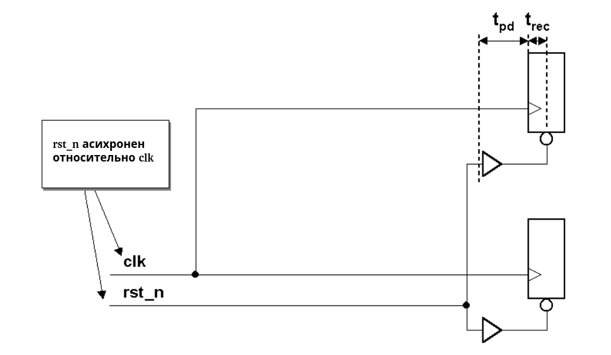

# 6. Проблема асинхронного сброса

Обсуждая тему этой статьи с коллегой, он сначала заявил, что, поскольку работал только с ПЛИС, у них нет тех же проблем со сбросом, что и у ASIC (ошибочное предположение). Далее он сказал, что у него всегда был асинхронный системный сброс, который мог переопределить всё, чтобы перевести микросхему в известное состояние. Затем его спросили, что произойдёт с ПЛИС или ASIC, если сброс произойдёт по фронту тактового сигнала или вблизи него,и триггеры перейдут в метастабильное состояние.

Многие инженеры просто применяют асинхронный сброс, думая, что проблем нет. Они тестируют сброс в контролируемой среде моделирования, и всё работает нормально, но затем в системе дизайн периодически даёт сбои. Разработчики не учитывают тот факт, что снятие сброса в системе (неконтролируемой среде) может привести к переходу микросхемы в метастабильное неизвестное состояние, тем самым обесценивая сброс. Необходимо уделять внимание снятию сброса, чтобы предотвратить переход микросхемы в метастабильное неизвестное состояние при сбросе. При использовании синхронного сброса как передний, так и задний фронты сброса должны располагаться вдали от активного фронта тактового сигнала.

Как показано на рисунке 8, асинхронный сигнал сброса будет снят асинхронно с тактовым сигналом. В этом сценарии есть две потенциальные проблемы: 1 - нарушение времени восстановления (recovery) сброса и 2 - снятие сброса (removal) в разных тактовых циклах для разных последовательных элементов.

      

 Рисунок 8 — Проблема времени восстановления при асинхронном сбросе 

## 6.1 Время восстановления сигнала сброса

Время восстановления после сброса относится к времени между моментом снятия сигнала сброса и моментом, когда тактовый сигнал снова становится высоким. Стандарт Verilog-2001 [29] содержит три встроенные команды для моделирования и тестирования времени восстановления и проверки времени снятия сигнала: $recovery, $removal и $recrem (последняя представляет собой комбинацию проверок времени восстановления и снятия сигнала).Время восстановления также называется временем установки tsu и имеет вид «PRE or CLR inactive setup
time before CLK ↑» [1]. Пропуск времени восстановления может привести к проблемам с целостностью сигнала или метастабильностью выходных данных.

## 6.2 Снятие сброса, проходящее через разные такты

Если снятие сброса происходит асинхронно с нарастающим фронтом тактового сигнала, небольшие различия в задержках распространения сигнала сброса и тактового сигнала, или обоих, могут привести к тому, что некоторые регистры или триггеры выйдут из состояния сброса раньше других.
