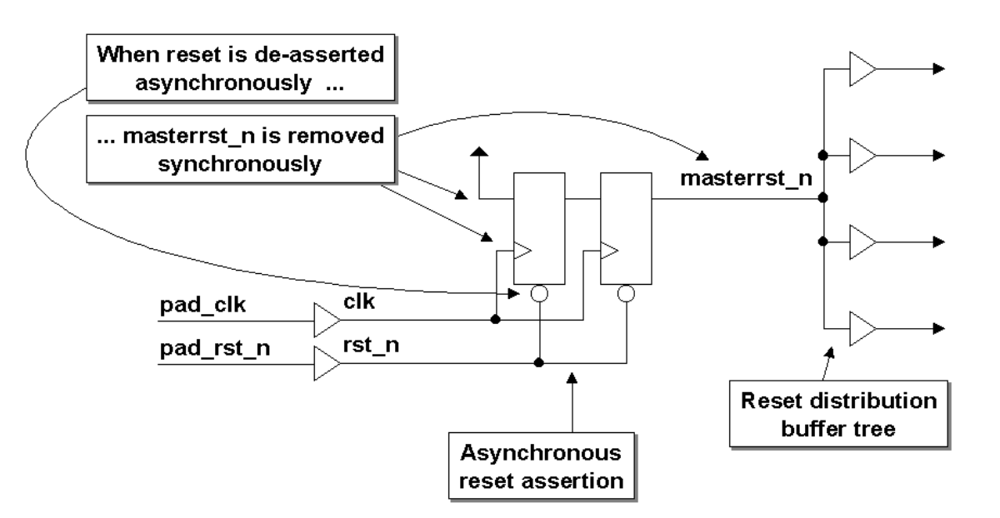

# 7.0 Синхронизаторы сброса

# КАЖДАЯ ASIC, ИСПОЛЬЗУЮЩАЯ АСИНХРОННЫЙ СБРОС, ДОЛЖНА ВКЛЮЧАТЬ В СЕБЯ СХЕМУ СИНХРОНИЗАЦИИ СБРОСА!!

Без синхронизатора сброса асинхронный сброс в итоговой системе бесполезен, даже если сброс работает во время моделирования. Логика синхронизатора сброса на рисунке 9 разработана таким образом, чтобы использовать преимущества как асинхронного, так и синхронного стилей сброса.

      

 Рисунок 9 — Блок-схема синхронизатора сброса  

